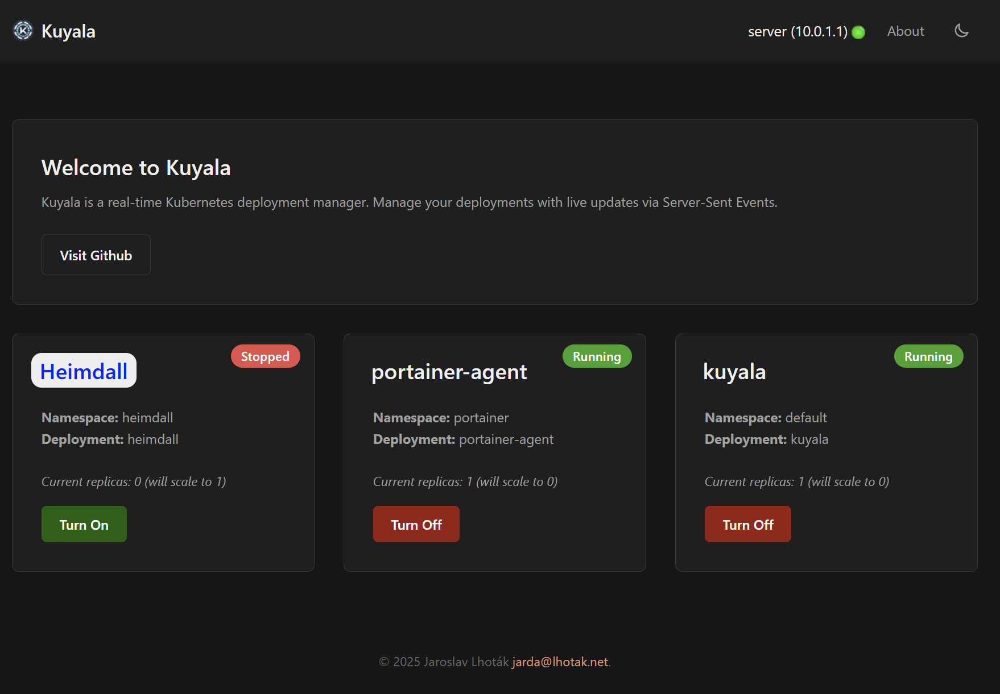

# Kuyala


Kuyala is a simple Kubernetes Dashboard for managing designated deployments. It adds switch feature on/off of your Deployments.

## The story behind Kuyala
The DevOps journey often follows a familiar path. We begin by containerizing applications with Docker, quickly graduating to docker-compose for local orchestration. As our needs mature, the quest for robust, scalable deployment leads us to tools like Swarm or, for many, the powerful UI-driven experience of Portainer, especially when embracing GitOps workflows.
Inevitably, the leap to Kubernetes feels like the logical next step. The power and flexibility are undeniable, but so is its resource footprint. In environments like a homelab or a single-node cluster, this becomes particularly evident.
The challenge arises when you need a simple function: to scale a non-critical deployment down to zero to conserve resources, much like the simple "stop stack" button we grew accustomed to in other tools. The "enterprise-grade" solution often involves implementing a full observability stack with Prometheus and an event-driven autoscaler like KEDA. While incredibly powerful, this can feel like overkill for such a straightforward goal.
This project was born from that exact need: to bridge the gap between the operational simplicity of tools like Portainer and the powerful orchestration of Kubernetes.
Initially developed to optimize my own single-node setup, the goal was to build it with production-grade principles. It leverages Server-Sent Events (SSE) for a responsive, real-time UI, runs on a Gunicorn engine patched with gevent for high-concurrency, and includes self-healing logic to ensure stability.
This tool is intentionally lean, but community contributions are highly encouraged. If you see a need for features like authentication, RBAC integration, or anything else, feel free to open an issue or submit a pull request

## Installation & Configuration

The application supports multiple run configurations. While local and Docker-based methods are provided for development and testing, the primary deployment target is a Kubernetes cluster.

The application is configured using the following variables

| Variable             | Description                                                                                               | Default |
|----------------------|-----------------------------------------------------------------------------------------------------------|---------|
| `LOG_LEVEL`          | Logging level: `DEBUG`, `INFO`, `WARNING`, `ERROR`, `CRITICAL`.                                           | `INFO`  |
| `KUBECONFIG`         | Absolute path to the kubeconfig file (default is `~\.kube\config`. Applicable only when you run in locally | -       |
| `KUBECONFIG_CONTENT` | Raw content of the kubeconfig file.                                                                       | -      |

## Enabling Kuyala

Kuyala uses an annotation-driven discovery mechanism. For a deployment to be managed, it must have the `kuyala.enabled` annotation. 
While this is the minimum requirement for visibility, additional annotations can be used for further configuration.

```yaml
  annotations:
    kuyala.enabled: "true"              # If present Kuyala will show up on the dashboard
    kuyala.applicationName: "Heimdall"  # Optional. Name of the application, if not provided it will use the deployment name
    kuyala.backgroundColor: "#333ddd"   # Optional. Hex value of the lozenge background color with the application
    kuyala.color: "black"               # Optional. Hex value of the text color of the application    
    kuyala.replicasOff: "0"             # Optional. Number of replicas defining the application is "turner off", default 0. Note it's a string as annotations don't accept numbers
    kuyala.replicasOn: "1"              # Optional. Number of replicas defining the application is "turner on", default 1.  
```

Changes of the deployments are propagated immediately to the dashboard. 

### 1. Kubernetes Cluster

Deploy the application and all its required resources by applying the single manifest file:

```sh
kubectl apply -f k8s/kuyala_manifest.yaml
```
This automatically configures the `Deployment`, a `LoadBalancer Service`, and the necessary RBAC permissions (`ClusterRole`, `ClusterRoleBinding`, `ServiceAccount`). 
The application uses this service account for in-cluster authentication, which requires cluster-wide read permissions and the ability to scale deployments.
    
### 2. Docker Compose

This is the easiest way to run the application with Docker. See the sample `docker-compose.yml` file for configuration details.

**Steps:**

1.  **Create a `.env` file:**
    Create a file named `.env` in the project root and add your environment variables. This file is ignored by Git.
    ```env
    # .env
    LOG_LEVEL=INFO # Options are: DEBUG, INFO, WARNING, ERROR, CRITICAL
    # KUBECONFIG_CONTENT="" # Optional: paste kubeconfig content here 
    ```
    The recommended way is to map your kubeconfig to a volume.
    ```dockerfile
    volumes:
       - ~/.kube:/home/nonroot/.kube:ro
    ```

2.  **Run Docker Compose:**
    ```sh
    docker-compose up -d
    ```
    The application will be available at `http://localhost:5000`.


### 3. Local Development (Without Docker)

This method is ideal for development and testing, giving you a live-reloading server.

1.  **Run the setup script:**
    This script will create a Python virtual environment in a `venv` directory and install all required dependencies from `requirements.txt`.
    ```sh
    ./local_development_setup.sh
    ```

2.  **Activate the virtual environment:**
    You must activate the environment in your shell to use the installed dependencies.
    ```sh
    source venv/bin/activate  # On Windows, use `venv\Scripts\activate`
    ```
    Make sure you have your `.env` file loaded or `~/.kube/config` exists.

3.  **Run the development server:**
    This script starts a Flask development server with auto-reload enabled.
    ```sh
    ./kuyala_development.sh
    ```
    The application will be available at `http://localhost:5000`.

4.  **Run the production setup:**
    Run for ensuring the code is ready. This script is being used in dockerfile
    ```sh
    ./kuyala_production.sh
    ```
    The application will be available at `http://localhost:5000`.

4. **Operations with local docker**
    To build to locally run `./docker/docker_build.sh`. 
    To start the docker run `./docker/docker_start.sh
    To stop and remove the container `./docker/docker_stop.sh`

## Known issues / Limitations / Ideas
Option 3 (As a "Current Limitations" Section)
Current Limitations
* No Built-in Authentication: Kuyala is intended for use in trusted, private network environments and lacks an internal authentication layer. For exposure to the internet, it should be placed behind an authenticating proxy.
* Deployment Resources Only: The core functionality is strictly limited to managing `Deployment` resources. There is currently no support for toggling other workloads like `StatefulSets` or `Jobs`.

Feel free to raise an issue or better a PR :)